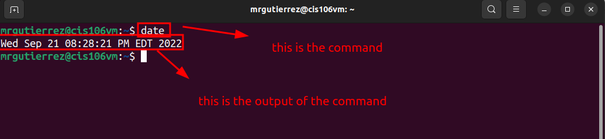

# Lab 3 Submission

## Question 1
Has no submission 

## Question 3

| Program purpose     | Package Name      | Version                           |
| ------------------- | ----------------- | --------------------------------- |
| Play a tetris game  | blockattack       | jammy 2.7.0-1 amd64               |
| Play a video file   | dragonplayer      | jammy 4:21.12.3-0ubuntu1 amd64    |
| Browse the internet | epiphany-browser  | jammy-updates 42.4-0ubuntu1 amd64 |
| Read your email     | plasma-gmailfeed  | jammy 1.1-2 amd64                 |
| Play music          | jammy 1.1-2 amd64 | jammy,jammy 20201215-2 all        |

1. Which command did you use to install?
   sudo apt install package+

2. Which command did you use to remove?
   sudo apt remove package-

3. Which command will you use to install and remove?
   sudo apt install package+ package-

## Question 4

| command | what it does                                 |
| ------- | -------------------------------------------- |
| echo    | display a line of text                       |
|         |
| fortune | print a random, hopefully, interesting,adage |
| cowsay  |                                              |
| lolcat  |                                              |
| figlet  |                                              |
| toilet  | display large colourful characters           |
| rig     |                                              |