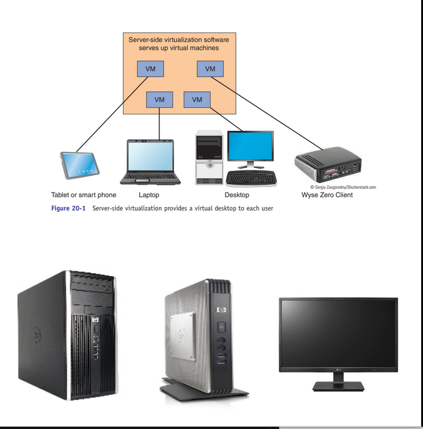
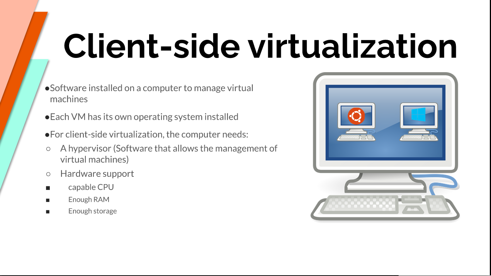

# Week Report 2

## The basics of virtualization 

1. **What is virtualization**
   Definition of virtualization
      * Sever side virtualization - Is a Virtual Desktop Infrastructure (VDI).
   Such as Thick client or fat client, Thin client, and Zero client

    
    * Client side virtualization - Software installed on a computer to manage virtual machines. 
    

    

2. **Types of virtualization**

   * Type 1 - Runs on the hardware
   Examples are: VMware ESX and ESXi
   Citrix XenSever

   * Type 2 - Runs on a Host Operating System
   Examples are: VMware Workstation Player/Pro
   Oracle VirtualBox

## Installing Ubuntu in Virtualbox
* Virtual machine start up

* Inputting account information

* Installing Ubuntu

* Ubuntu live session

* Creating Snapshots

