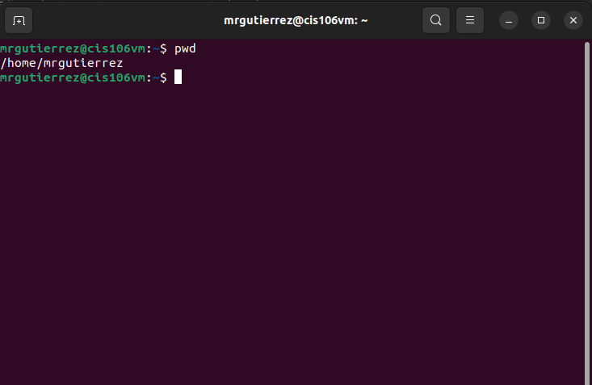
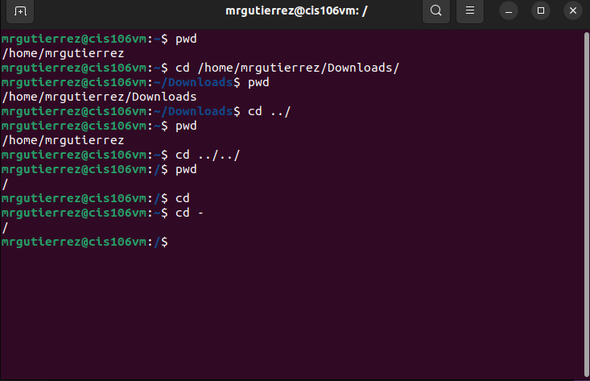
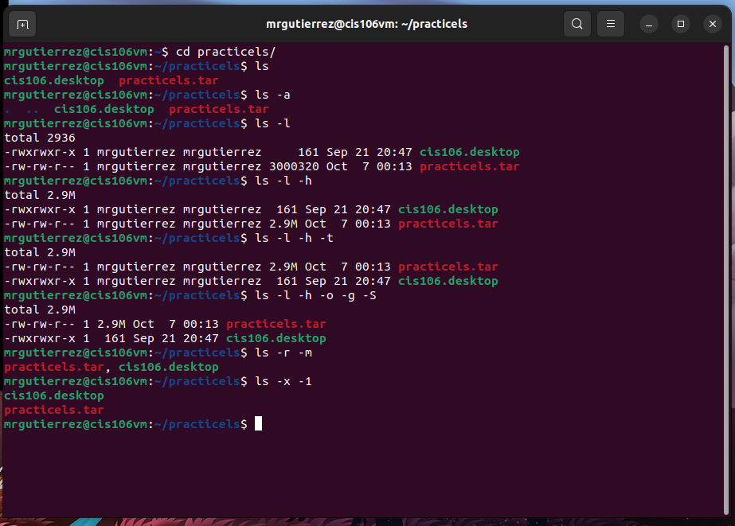

# Week Report 4

## Practice

## The Filesystem (Some important Directories)

| Directory | Data Stored in Directory                                                                                                                    |
| --------- | ------------------------------------------------------------------------------------------------------------------------------------------- |
| bin       | Essential commands                                                                                                                          |
| dev       | Device files                                                                                                                                |
| etc       | System configuration files                                                                                                                  |
| home      | User home directories                                                                                                                       |
| media     | Mount point for removable media, such as DVDs and floppy disks                                                                              |
| opt       | Add- on software packages                                                                                                                   |
| proc      | Kernel information, process control, system hardware information                                                                            |
| srv       | Information relating to services that run on the system                                                                                     |
| usr       | Software not essential for system operation, such as applications                                                                           |
| var       | Dedicated to viriable data such as logs, databases, websites, and temporary spool (e-mail etc) files that persist from one boot to the next |

## Commands to navigate the filesystem 

| Command | What it does                                  | Syntax | Example |
| ------- | --------------------------------------------- | ------ | ------- |
| Pwd     | Prints current working directory              | `pwd`  | `pwd`   |
| Cd      | Prints changing the current working directory | `cd`   | `cd`    |
| Ls      | Prints all the files inside a given directory | `ls`   | `ls`    |

## Key Terms

**Definitions of the following terms**

* File system: The way files are stored and organized to simplify access to data.

* Current directory: The directory where you are at the moment.

* Parent directory: You are always working inside a particular directory and you can move forward a subdirectory or backwards to the previous directory. 

* The difference between your home directory and the home directory: your Home directory is a user of the system and consists of individual files. The home directory is the one that the system has created. 

* Pathname: Indicates the location of the file in the filesystem (like an address).

* Relative path: The location of a file starting from the current working directory or a directory that is located inside the current working directory.

* Absolute path: The location of a file starting a the root of the file system

* The commands are used for navigating the filesystem.
 * pwd
* cd
* ls
