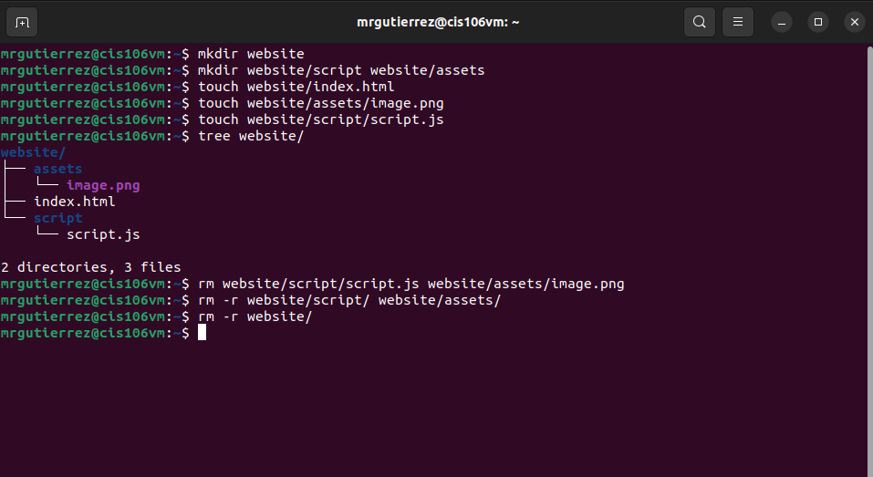
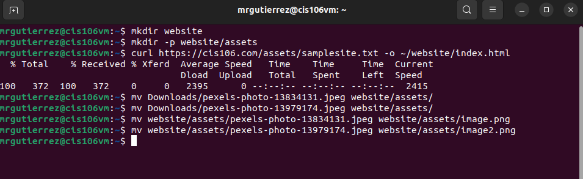
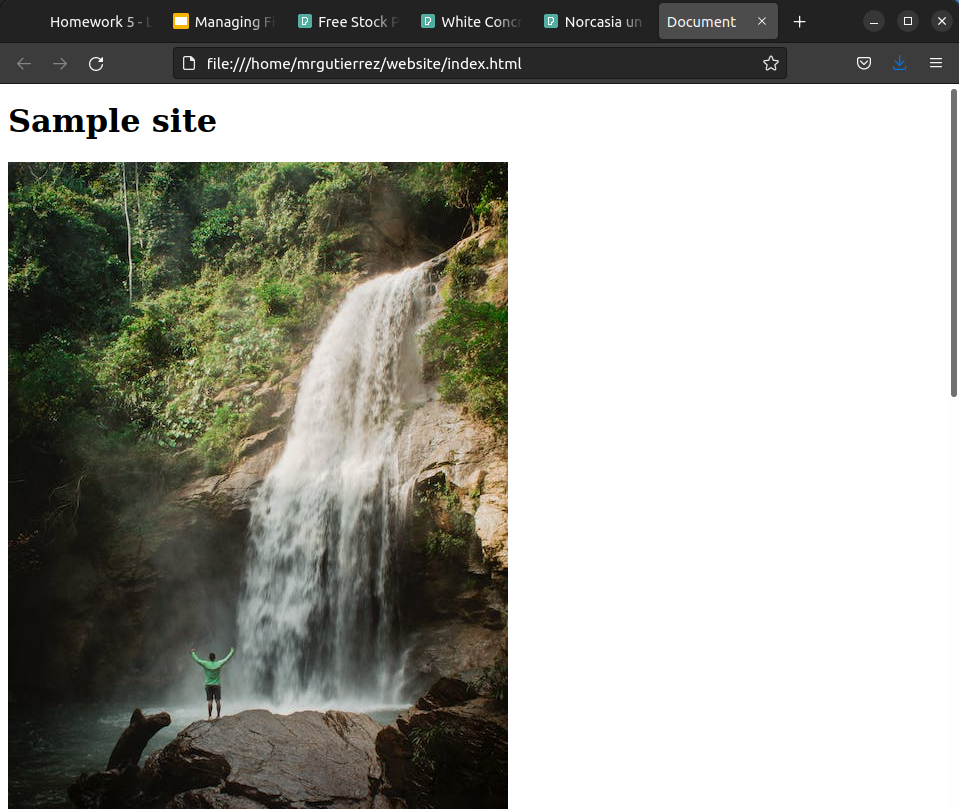
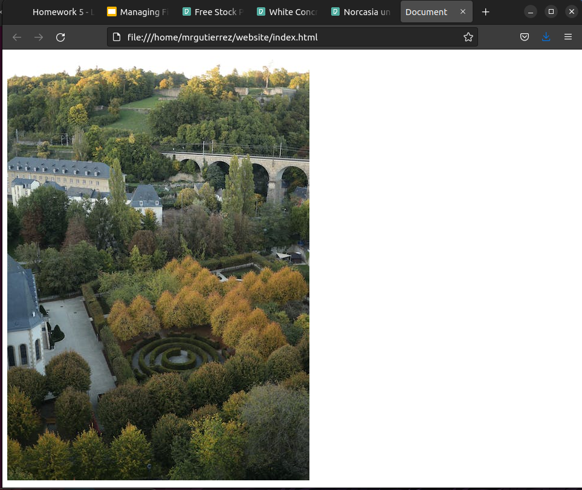
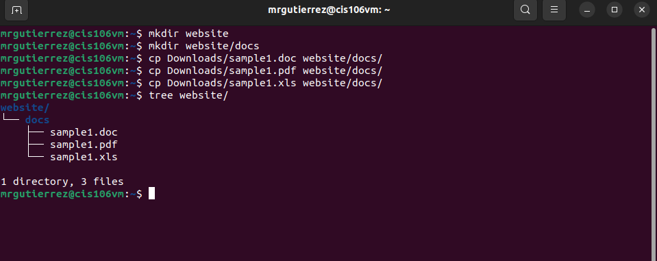

# Week Report 5

## What are Command Options?
Command options modify/enhance their behavior.
## What are Command Arguments?
Command arguments are the items open which the command acts on. 
## Which command is used for creating directories? Provide at least 3 examples.
The command for making directories is mkdir. To create a directory use this formula. `mkdir + directory name`
### Examples:
* create a directory in the present working directory
* `mkdir wallpapers`
* create a directory in a different directory using relative path. 
* `mkdir wallpapers/ocean`
* create a directory in a different directory using absolute path 
* `mkdir ~/wallpapers/forest`
## What does the touch command do? Provide at least 3 examples.
The touch command is used for creating files. To create a file use this formula. `touch + file name`
### Examples:
* To create a file called list
* `touch list`
* To create several files
* `touch list_of_cars.txt script.py names.csv`
* To create a files with a space in its name 
* `touch "list of foods.txt"`
## How do you remove a file? Provide an example.
You remove a file by the `rm` command.
### Example:
* Remove a file 
* `rm list`
## How do you remove a directory and can you remove non-empty directories in Linux? Provide an example
To remove and empty directory by doing `rm -r + directory name`
You can not remove a non-empty directory in linux. 
### Example:
* Remove an non-empty directory
* `rm -r Downloads/games`
## Explain the mv and cp command. Provide at least 2 examples of each 
The mv command is used to move and rename directories. To use the mv command to move directories use this formula `mv + source + destination`
TO use the mv command to rename files/directories use this formula `mv + file/directory to rename + new name`
 
The cp command is used to copy files/directories from a source to a destination. To use the cp command to copy files use this formula `cp + files to copy + destination`
To use the cp command to copy directories use this formula `cp -r + directory to copy + destination`

### Examples 
*To move a file from a directory to another using relative path 
* `mv Downloads/homework.pdf Documents/`
* To move and rename a file in the same command 
* `mv Downloads/cis106homework.docx Documents/new_cis106homework.docx`
  
* To copy a file 
* `cp Downloads/wallpapers.zip Pictures/`
* To copy a directory with absolute path 
* `cp -r ~/Downloads/wallpapers ~/Pictures/`

## Practice 
* Practice 1

* Practice 2

* practice 3

* Practice 4

