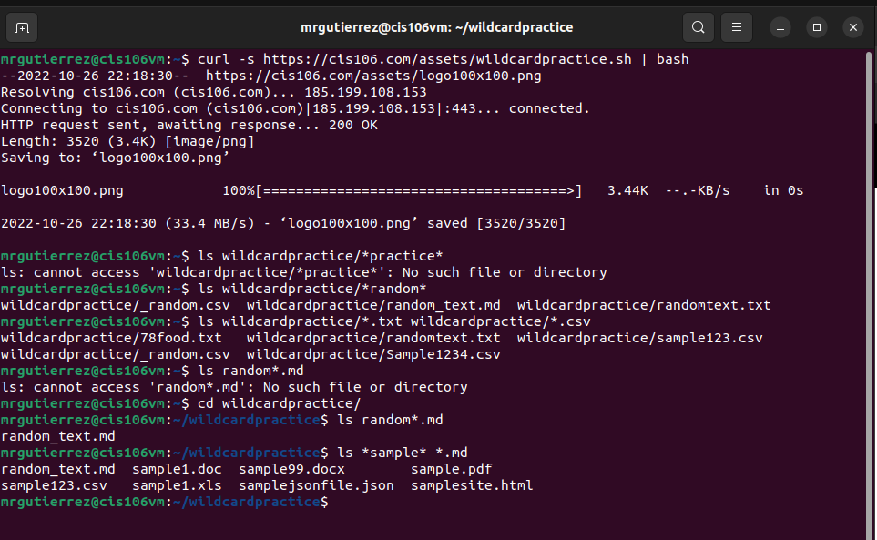
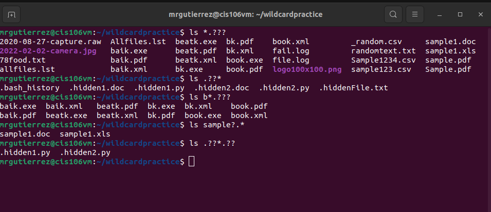
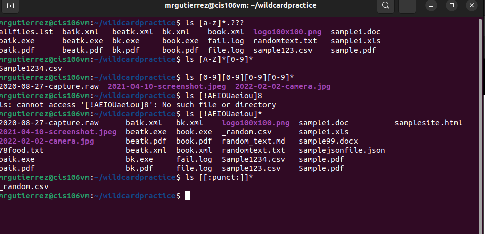

# Week Report 6

## Wildcards.

### * wildcard
The * Wildcard matches from 0 to any number of characters.
* Examples:
  * List all the text file in a directory
    * `ls *.txt`
  * List all the files that start with the word file
    * `ls file.*`
  * Copy all the mp4 files 
    * `cp Downloads/*.mp4 ~/Videos/Movies/`

### ? wildcard
The ? Wildcard matches a single character.
* Examples:
  * List all the files that have a 3 letter file extension
    * `ls *.???`
  * List all the files that have two characters between b and k
    * `ls b??k*`
  * To list all hidden files
    * `ls ./.??*`

### [] Wildcard
The [] Wildcard matches a single character from a set
* Examples:
  * To match all the files that have a vowel after letter f.
    * `ls f[aeiou]*`
  * To match all the files whose name has at least one number
    * `ls *[0-9]*`
  * To match all files whose names begins with a letter from a-p or start with letter s or c
    * `ls [a-psc]*`

### Brace Expansion
The {} expansion allows you to generate arbitrary strings to use with commands
* Examples: 
  * To create a whole directory structure in a single command.
    * `mkdir -p music/{jazz,rock}/{mp3files,videos,oggfiles}/new{1..3}`
  * To create a N number of files use.
    * `touch file{A..z}.txt`
  * Remove multiple files in a single directory
    * `rm -r {dir1,dir2,dir3,file.txt,file.py}`
  
  ## Practice 

* Practice 5

* Practice 6

* Practice 7
* 